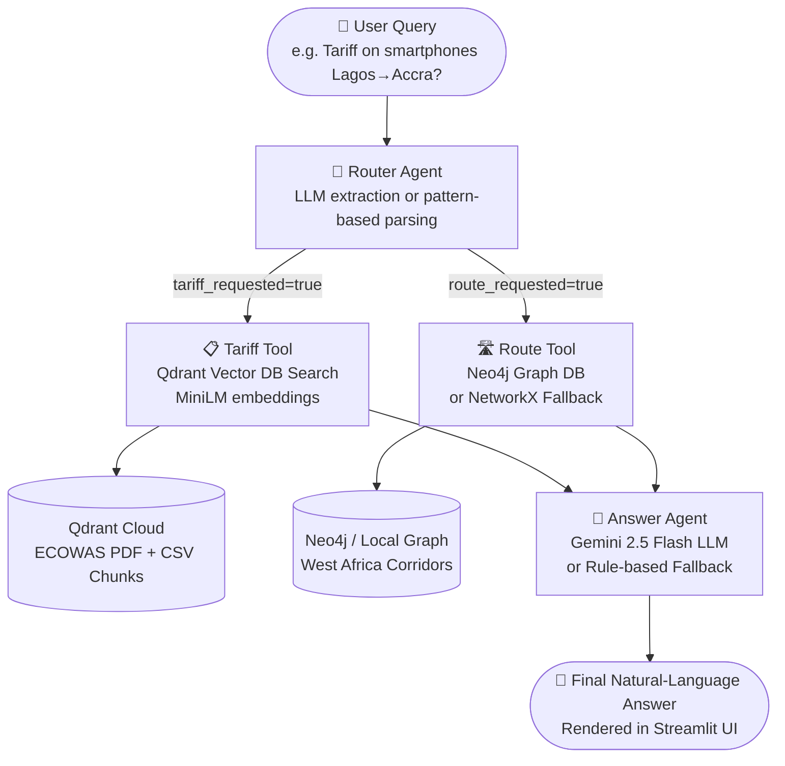

# 🌍 AfriTrade Agent — ECOWAS Trade Intelligence Platform

> **Week 3 Submission** — Agentic Reasoning with LangGraph, Qdrant & Neo4j/NetworkX

AfriTrade Agent is an intelligent, multi-step agentic system that answers complex cross-border trade questions across ECOWAS West Africa. It searches tariff data from a vector database, computes optimal corridor routes from a graph database, and synthesises a natural-language answer — all in a single conversational flow.

---

## 🧠 System Architecture



---

## ⚙️ Agentic Flow (LangGraph State Machine)

```
User Query
    │
    ▼
┌─────────────────┐
│  Router Agent   │  ← Extracts: commodity, start_hub, end_hub,
│  (Node 1)       │    tariff_requested, route_requested
└────────┬────────┘
         │
    ┌────┴────┐
    ▼         ▼
┌────────┐ ┌──────────┐
│ Tariff │ │  Route   │
│  Tool  │ │  Tool    │
│(Node 2)│ │ (Node 3) │
└────────┘ └──────────┘
    │           │
    │  Qdrant   │  Neo4j / NetworkX
    │  VectorDB │  Graph Pathfinder
    │           │
    └─────┬─────┘
          ▼
    ┌──────────────┐
    │ Answer Agent │  ← Synthesises tariff + route data
    │   (Node 4)   │    via Gemini API or template fallback
    └──────┬───────┘
           ▼
    💬 Final Answer (Streamlit UI)
```

---

## 📁 Project Structure

```
afritrade/
├── app.py              # Streamlit UI with agentic reasoning visualization
├── agentic_flow.py     # LangGraph state machine (Router, Tariff, Route, Answer nodes)
├── tools.py            # Tool functions: tariff_search_tool, route_finder_tool
├── graph_db.py         # Neo4j + NetworkX hybrid graph of ECOWAS corridors
├── embeddings.py       # MiniLM sentence embedding model wrapper
├── ingest.py           # PDF/CSV ingestion pipeline → Qdrant
├── requirements.txt    # Python dependencies
├── Data/               # ECOWAS CET PDFs and CSV files
└── .streamlit/
    └── secrets.toml    # Qdrant, Gemini, and Neo4j credentials
```

---

## 🚀 Quick Start

### 1. Install Dependencies
```bash
pip install -r requirements.txt
```

### 2. Configure Secrets
Add your credentials to `.streamlit/secrets.toml`:
```toml
QDRANT_URL     = "https://your-cluster.qdrant.io"
QDRANT_API_KEY = "your-api-key"

# Optional — for LLM reasoning
# GEMINI_API_KEY = "AIza..."

# Optional — for Neo4j graph database
# NEO4J_URI      = "neo4j+s://xxx.databases.neo4j.io"
# NEO4J_USER     = "neo4j"
# NEO4J_PASSWORD = "your-password"
```

### 3. Ingest ECOWAS Documents (first run only)
```bash
python ingest.py
```

### 4. Run the Application
```bash
streamlit run app.py
```

---

## 🛠️ Technology Stack

| Component | Technology |
|---|---|
| **UI Framework** | Streamlit |
| **Agentic Orchestration** | LangGraph (StateGraph) |
| **LLM / Synthesis** | Google Gemini 2.5 Flash (HTTP API) |
| **Vector Database** | Qdrant Cloud |
| **Embeddings** | MiniLM (all-MiniLM-L6-v2) |
| **Graph Database** | Neo4j (primary) / NetworkX (fallback) |
| **Data Sources** | ECOWAS CET PDFs, Trade corridor CSV data |

---

## 🌍 Supported Trade Hubs (Graph Nodes)

| Hub | Country |
|---|---|
| Lagos | Nigeria |
| Cotonou | Benin |
| Lomé | Togo |
| Accra | Ghana |
| Abidjan | Côte d'Ivoire |
| Ouagadougou | Burkina Faso |
| Niamey | Niger |
| Bamako | Mali |
| Dakar | Senegal |

Key corridor covered: **Abidjan–Lagos Corridor**, **Dakar–Bamako**, **Trans-Sahelian**, **Lagos–Kano–Niger**

---

## 📋 ECOWAS CET Tariff Bands

| Band | Category | Rate |
|---|---|---|
| Band 0 | Essential Social Goods | 0% |
| Band 1 | Essential Goods & Raw Materials | 5% |
| Band 2 | Intermediate Products | 10% |
| Band 3 | Finished Consumer Goods | 20% |
| Band 4 | Specific Goods / Economic Development | 35% |

---

## 📦 Sample Query

> *"What's the tariff on 50 smartphones from Lagos to Accra and the fastest route?"*

**Agent Flow:**
1. **Router Agent** → Extracts: `commodity=smartphones`, `start=Lagos`, `end=Accra`, `tariff_requested=True`, `route_requested=True`
2. **Tariff Tool** → Searches Qdrant for "smartphones tariff rate ECOWAS CET" → Returns Band 3 (20%) chunks
3. **Route Tool** → Queries graph for Lagos→Accra → Returns: Lagos ➔ Cotonou ➔ Lomé ➔ Accra (460 km, ~21.5 hrs, 30 checkpoints)
4. **Answer Agent** → Synthesises both into a comprehensive natural-language response

---

## 🔒 Security Notes

- Never commit `.streamlit/secrets.toml` to version control (it is `.gitignore`d)
- API keys entered in the Streamlit sidebar are session-scoped and never persisted to disk

---

*Built for the AfriTrade Agent Hackathon — Week 3 Submission*
