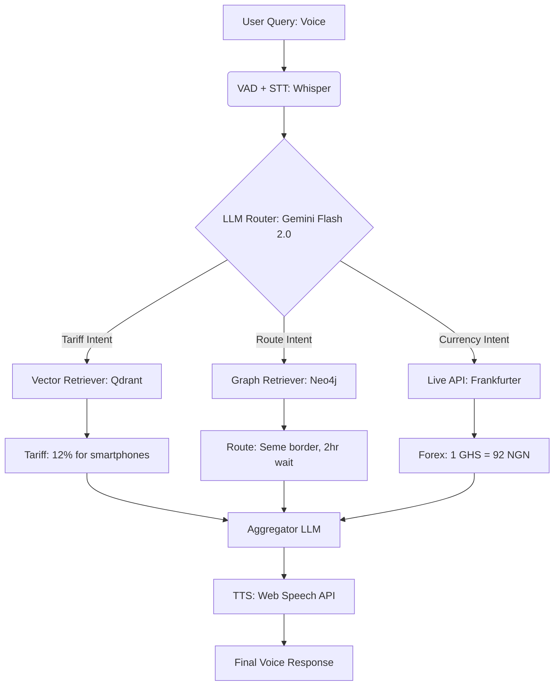

## Mock Voice Flow Diagram (Text‑based)

```text
[START: User Speaks]

       │
       ▼
[1. VAD] Voice Activity Detection
       │ Detects User Speaking
       ▼
[2. STT] Whisper (Free Tier via Hugging Face) - Transcribes Speech
       │ "What's tariff for 50 smartphones from Lagos to Accra?"
       ▼
[3. LLM Router] Gemini 1.5 Flash (Free Tier)
       │ Analyzes Query: Intent = Tariff + Route + Currency
       ├──────────────┬──────────────┐
       ▼              ▼              ▼
[4a. Tariff Agent]   [4b. Route Agent]   [4c. Currency Agent]
│ Vector Search (Qdrant) │ Graph Query (Neo4j) │ Live API (Frankfurter)
│ "ECOWAS rate = 12%"    │ "Fastest = Seme"   │ "1 GHS = 92 NGN"
└──────────┬──────────────┴──────────────┬─────┘
           ▼                             ▼
[5. Aggregator] LLM synthesizes combined response
       │ "For 50 smartphones from Nigeria to Ghana...
       │  Tariff is 12%. Fastest route: Seme border (2-hour wait).
       │  Exchange rate: 1 GHS = 92 NGN."
       ▼
[6. TTS] Web Speech API (Client-side) → Audio Reply
       │
       ▼
[END: Wait for next query]
```

## Mock Voice Flow (Text + Diagram)

### High‑level conversation design (English + Pidgin/Swahili code‑switching)

**User:** "What's the tariff for taking 50 smartphones from Lagos to Accra?"

**Agent:** (2 second pause) "For 50 smartphones from Nigeria to Ghana, the ECOWAS tariff is 12% of value. No extra tax if they are for resale. Do you want the fastest route too?"

**User:** "Yes, and the cedi exchange rate."

**Agent:** "Fastest route: Seme border – wait time today is 2 hours. Cedi to naira: 1 GHS = 92 NGN. Need anything else?"

**User:** "No."

**Agent:** "Safe journey. You can ask about other products anytime."

